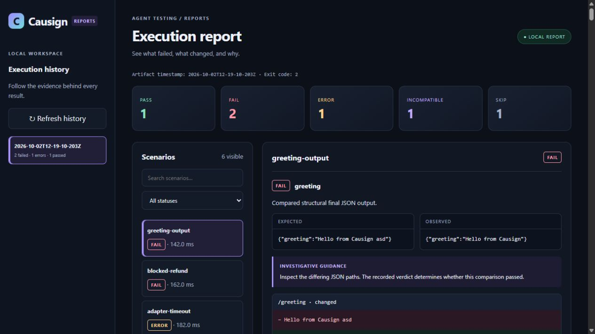

# Local reports

Development preview: this feature is available in the repository build, not in the published npm `0.1.0` CLI. Temporary executors such as npx and pnpm dlx work with a packed build or a future version containing the feature; invoking `@causign/cli@0.1.0 report` will not work.

The local report viewer makes failures easier to investigate. Choose an execution, filter scenarios, compare expected and observed values, and open the trace event supporting an assertion. It reads completed artifacts and does not run agents from the browser.



## Open a report

From a project using a CLI build that includes the viewer:

```sh
pnpm exec causign run --open
pnpm exec causign report
pnpm exec causign report --no-open
pnpm exec causign report --output-dir ./saved-results --port 4317
```

For the current repository build, use an absolute path from your tested project:

```sh
node /absolute/path/to/Causign/packages/cli/dist/bin.js run --open
node /absolute/path/to/Causign/packages/cli/dist/bin.js report
```

On Windows quote paths with spaces. Build the repository with `pnpm build` first.

If you have packed this CLI into a tarball, temporary invocation is also supported:

```sh
npx --yes --package=/absolute/path/to/causign-cli-0.1.0.tgz causign report
pnpm --package=/absolute/path/to/causign-cli-0.1.0.tgz dlx causign report
```

Install or pack its workspace dependencies as described in the installation guide. A tarball is not a self-contained bundle of those dependencies. After a release containing the feature, `npx --yes --package=@causign/cli@<version> causign report`, `pnpm dlx @causign/cli@<version> report`, and the equivalent `pnpx` command can use that released version.

`report` defaults to `.causign/results` relative to the invocation directory. It does not require a config file and does not import scenario modules. A missing root is an error; an empty existing root shows instructions to run tests. History lists immediate execution directories and labels the timestamp encoded in their names as the artifact timestamp.

The CLI prints a localhost URL and opens your default browser. `--no-open` prints the URL without launching a browser. Browser launch failure also leaves the URL usable. The server remains in the foreground: press **Ctrl+C in the terminal** to stop it. Closing the browser tab does not stop the server. The default port is assigned automatically; an occupied explicit port reports an error.

## Read a failure

- The summary separates PASS, FAIL, ERROR, INCOMPATIBLE, and SKIP, and preserves the suite exit code and interrupted state.
- Every assertion retains its recorded expected, observed, and reason fields. Investigative guidance appears separately.
- JSON equality comparisons highlight changed, missing, and unexpected paths. Negated equality explains when output matched a prohibited value. Object key order does not create a difference.
- Evidence links jump to recorded messages, including later timeline pages. Metrics and evaluator references show their recorded values and provenance.
- Timeline entries distinguish requests, decisions, execution, mocks, and rejection. A request does not prove execution, and an incomplete trace cannot prove absence.
- Infrastructure and protocol errors show diagnostics. Missing capabilities explain why an INCOMPATIBLE scenario could not be evaluated.

Explanations are deterministic and use saved facts; there are no LLM calls or inferred root causes. Missing or corrupt plans/traces produce visible warnings while valid assertion summaries remain readable. Invalid executions remain visible in history rather than hiding valid executions. Refresh history explicitly to find newly completed runs.

## Exit codes and CI

Plain `causign run` remains unchanged and is the command to use in CI. No server starts implicitly.

`run --open` first runs tests and saves artifacts, then opens the viewer. When you stop viewing, it returns the original suite exit code: PASS/SKIP 0, FAIL 1, ERROR 2, or INCOMPATIBLE 3. Interrupting active execution retains exit code 130 and does not start the viewer. Failure to start the viewer after writing results is a separate diagnostic and does not rewrite the test verdict.

`report` returns 0 when deliberately stopped, even when historical tests failed. Startup failure returns 2. It is an inspection command, not a CI gate.

## Local data and limits

The server binds only to `127.0.0.1`, accepts read-only report requests, and uses a per-session access token. The initial URL contains that token in its fragment; the interface removes it from the visible URL and keeps it in the current tab's session storage to support refresh. Keep the printed URL local. It can access only the chosen results root and bundled interface assets, not a general repository filesystem.

Agent output, prompts, and diagnostics are rendered as text. Raw content is collapsed by default but is not automatically redacted. Reports can contain sensitive data. The viewer makes no external requests and does not upload reports.

You can copy a results root to another directory: the viewer loads indexed `plan-N.json` and `trace-N.json` files beside each `results.json`, ignoring stale stored absolute paths. It rejects linked files/directories and mismatched artifact references.

History is bounded to 1,000 execution directories and JSON files to 16 MiB each. Each API response is limited to 4 MiB; larger details return an explicit loading error, and the original files remain available for inspection. Replacing the selected root directory requires restarting the viewer. Timeline pages contain 200 events; JSON differences stop after 1,000 changed paths, with a truncation notice. Large individual displayed values are capped at 50,000 characters. These are viewing limits; they do not change recorded verdicts or rewrite artifacts.

Standalone HTML export, run comparisons, live updates, and execution from the browser are deferred.
